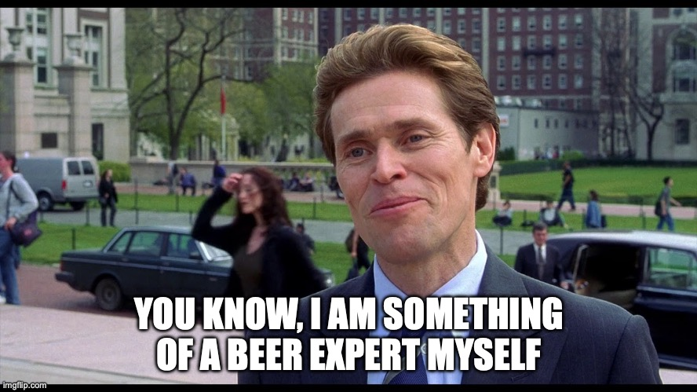

# Truth behing ratings

Our project tells the story of the ratings: where do they come from, what secrets do they hold, and what do they really mean?

## 0. You know, I am something of a beer expert myself

One of the metrics that will follow us throughout the project is the notion of user expertise. Indeed, users with more experience in the world of beer may have more valuable opinions, sometimes different from the majority consensus on the site. The key question is how to evaluate the user knowledge ?

- Number of beers rated
- Diversity of beers rated (styles)
- Diversity of beers rated (origins)
- Time since the user is registered in the website
- Rate of ratings (number of beers rated / known active time) where the known active time is the last rating date - the registration date
- Number of ratings with text (review)
    - Quality of text
    - Length of text

One idea might be to derive a new score adjusted according to the user's knowledge, based on the results observed.

## 1. Are we influenced by the current rating of the beer ?

**For a given beer, and many users ratings, how they ratings influence our on this beer**

This section looks at the variation in ratings given as a function of the beer's current average at the time of rating.

This analysis can be differentiated according to the following variables:
- Beer style
- Beer country
- User knowledge (defined above)
- User country
- Unweighted rating

## 2. Are we influenced by our past ratings ?

**For a given beer, and all of our past ratings, how they influence our rating on this beer**

This section looks at the influence of a user's past ratings on their current rating (are users converging more and more?).

This analysis can be differentiated according to the following variables:
- Beer style
- Beer country
- User knowledge (defined above)
- User country
- Unweighted rating

## 2.5 Analysis of 1. and 2.

Effects of 1 and 2 can be correlated, thus we need to use linear regression in order to disentangle both effects.

TODO : Finish preprocessing (cumulative mean)

## 3. This beer is "okay"...

**Analyze disparency between ratings grade and texts**

This section looks at the differences between textual comments and quantitative ratings. In particular, is there a difference between users?

This analysis can be differentiated according to the following variables:
- Beer style
- Beer country
- User knowledge (defined above)
- User country
- Unweighted rating

We will also try to derive an "sentiment"-corrected rating taking into account the disparancy.

TODO : Try to derive concrete formula for adjustment

## 4. I drink IPA by the way / Inflation due to HypeIA

**Analyze trends in beers (notion of hype)**

This section looks at the influence of trends on user ratings (e.g. inflation due to a trend in IPAs).

This analysis can be differentiated according to the following variables:
- Beer style
- Beer country
- User knowledge (defined above)
- User country
- Unweighted rating