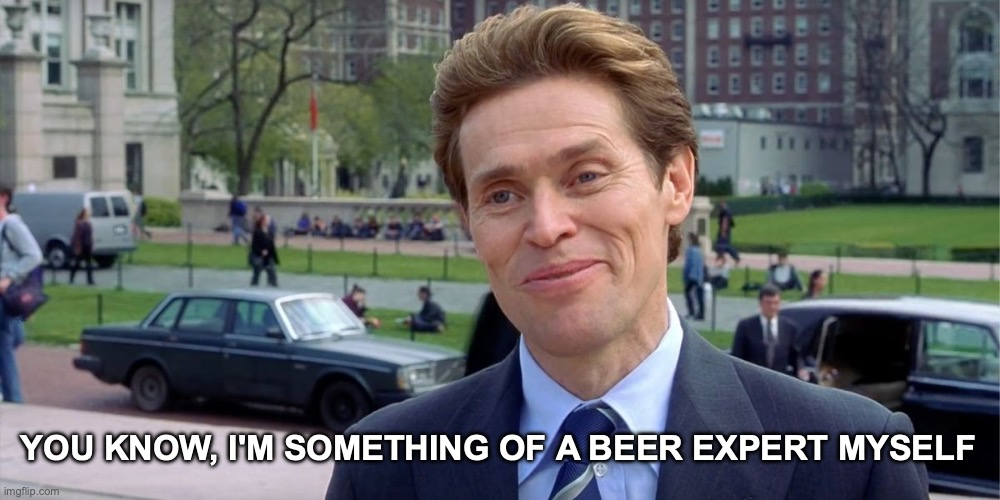

# 🍻 Truth behind ratings 🍻

##  📄 Abstract

The core of the project is the idea of exploring the influence of various factors on the ratings left by users, so as to gain a better understanding of the final ratings we can consult by visiting Beer Advocate or Rate Beer. In other words, what secrets do the ratings conceal? The goal of the project is therefore to identify several factors that may affect reviews, and to test our hypotheses against the data.

The motivation behind the project came from an informal discussion within the team about our disagreements over the ratings of certain movies. When it came time to come up with an idea for the project, we wanted to transpose our thoughts on the film question onto beer reviews. Let's embark on an adventure and find out as we go along that the ratings you use to pick your next beer may not be so truthful after all!



## 🔍 Research Questions

The questions we intend to answer concern various factors that could influence ratings.

1. How can we quantify users' knowledge of beer?
2. Are users influenced by the past rating of the beer ?
3. Are users influenced by their past ratings ?
4. Are text reviews and user scores consistent with each other?
5. Are users influenced by current trends in beer consumption ?

## 📦 Additional datasets

Our datasets are composed on information from two websites,  BeerAdvocate and RateBeer. Current review data ranges from August 1996 to August 2017 for BeerAdvocate and April 2000 to August 2017 for RateBeer. 

We thought of developing a scraper to retrieve more recent data from August 2017 to today. Nevertheless, after a preliminary analysis, we encountered some technical pitfalls. Indeed, the websites require users to be authenticated to consult reviews, and maybe impose a rate limit on queries, which could complicate information retrieval.
## 🎛️ Methods

Our analyses will attempt to answer the questions presented above, and for questions 2 to 5, they will also be carried out on different segments of users and beers such as the user's country, knowledge of beers, country of the beer, style of beer, etc. 

All our analyses will be conducted separately on the data from each website, and the results will be compared to determine whether they are consistent across the two websites.


### 1. How can we quantify users' knowledge of beer?

We will try to use different features and combination of features to derive a notion of beer knowledge for each user at different points in time.

Our first approach is to analyze the number of ratings and the user's review rate over time. More specifically, looking at the timeframe during which the user was active on the website.

The second approach we considered was to quantify the extent to which a user had tasted different styles of beer. We computed the normalized Gini impurity over the number of beers rated within each style at a given time. We thus obtain a metric in $[0, 1]$ where $0$ means that the user has rated only one style of beer and $1$ means that the user has rated as many beers of each style.

A third approach would be to analyze the texts backing up the ratings, assuming that the length of the text and the use of keywords from the beer lexical field would be a good indicator of knowledge. This list of keywords would be created manually by researching on the beer industry.

### 2. & 3. Are we influenced by our past ratings and the past rating of the beer ?

We believe that the effects of these 2 hypotheses may be correlated, and we therefore plan to analyze their impact using a linear regression with the following parameters of interest :
- Average of this user's past ratings
- Average of the beer at the time of rating
- Interaction term for the joint effect

After preliminary analyses, we performed an F-test on the coefficient of the interaction term at the $\alpha=0.01$ threshold. The test concluded on the rejection of the null hypothesis, so it seems that the interaction of the 2 effects is statistically significant.

We will analyse the results of the linear regression in more details, and add other parameters to observe their effects (e.g. past average by beer style).

### 4. Are text reviews and user scores consistent with each other?

In order to compare the similarity of textual reviews and scores, we will use an NLP model for sentiment analysis. More specifically, we found the model `nlptown/bert-base-multilingual-uncased-sentiment` [^1] which predict the sentiment of a review as an integer in $[1,5]$ which corresponds to the same range as the scores given by the users.

We will then use a distance metric to analyze the disparency between the text and the score. Those differences could be assesed using hypothesis testing where null hypothesis would be that there is no difference between means.

### 5. Are users influenced by current trends in beer consumption ?

In order to analyze the impact of trends on scores, we first need to identify trends. We intend to use a hybrid approach:
- Manually identify trends via research on news sites and market studies
- Automatically identify trends by analyzing the number of ratings for a certain style of beer as a function of the number of active users.

We will define the active status of a user according to parameters such as his review rate, the date since his last review and other parameters.

Subsequently, we plan to use hypothesis tests such as the T-test to compare average ratings during trends and outside them. 

We also plan to use a linear regression model to estimate the impact of trends on averages compared with off-trend averages.

## 🗓️ Proposed Timeline

| Period | Description |
|---|---|
| Week 1 : 18/11 - 24/11 | <ul><li>Implementation of user beer knowledge metrics (1)</li><li>Developement of scrapers to enrich datasets</li></ul> |
| Week 2 : 25/11 - 01/12 | <ul><li>Analysis of regression for effects (2) and (3)(more complex regresson, additional parameters)</li></ul> |
| Week 3 : 02/12 - 08/12 | <ul><li>Training and inference on text reviews to assess differences with ratings (4)</li><li>Identification of trends of beer consumption for certain styles (5)</li></ul> |
| Week 4 : 09/12 - 15/12 | <ul><li>Analysis of impact of trends on ratings (5)</li><li>Beginning of data story website and report</li></ul> |
| Week 5 : 16/12 - 20/12 | <ul><li>Finalize data story and report</li><li>Clean repository and verify all artefacts</li></ul> |

## 👥 Organization within the team

Our team consists of 2 members with a background in computer science and 3 with backgrounds in mathematics and physics. We will split the tasks to leverage each other's strengths while allowing all members to acquire new skills. 

## 📑 Instructions

Please download the datasets by folowing these commands :
```bash
cd src/scripts
python download.py
cd ../../
pip install -r pip_requirements.txt
```

## 🗄️ Project Structure

```
├── data                        <- Project data files
│
├── src                         <- Source code
│   ├── data                            <- Data directory
│   ├── models                          <- Model directory
│   ├── utils                           <- Utility directory
│   ├── scripts                         <- Shell scripts
│
├── tests                       <- Tests of any kind
│
├── results.ipynb               <- a well-structured notebook showing the results
│
├── .gitignore                  <- List of files ignored by git
├── pip_requirements.txt        <- File for installing python dependencies
└── README.md
```

## References

[^1]: NLP Town (2023). HugginFace - nlptown/bert-base-multilingual-uncased-sentiment. Available : https://huggingface.co/nlptown/bert-base-multilingual-uncased-sentiment
